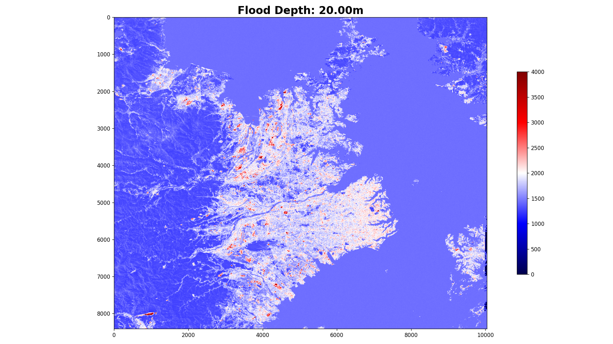

# Article 014



## 概要
- [データ元](src/000_data.ipynb)
  - [Sorabatake Open Data Google Drive](https://drive.google.com/drive/folders/12u8zH6-7kVcOcKi-oeaDw53AeSxOJUOg) 
- [シミュレーション](src/001_simulation.ipynb)
- [モデリング](src/002_modeling.ipynb)


## 環境構築
```shell
docker compose up -d
```
